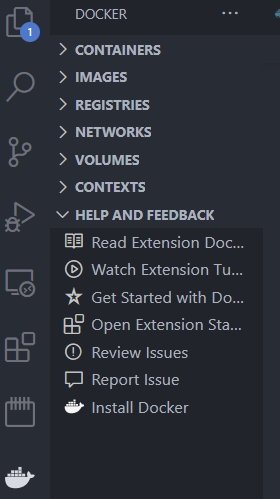
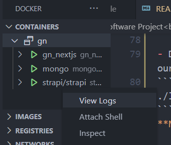
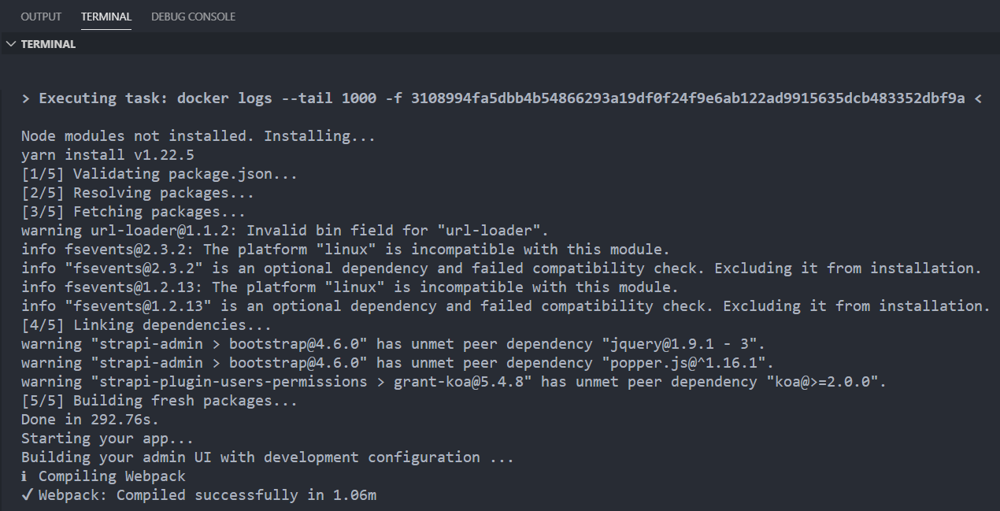

# SWEN90013 Masters Advanced Software Project<br />

*Year:* 2021<br />
*Team name*: Team GN<br />
*Inception sprint tag*: <https://github.com/SWEN90013-2021-GN/GN/releases/tag/Inception>  
*Sprint 1a tag*: https://github.com/SWEN90013-2021-GN/GN/releases/tag/1a  
*Sprint 1b tag*: TBA<br />
*Sprint 2a tag*: TBA<br />
*Sprint 2b tag*: TBA<br />
*Sprint 3a tag*: TBA<br />
*Sprint 3b tag*: TBA<br />
*Sprint 4a tag*: TBA<br />
*Sprint 4b tag*: TBA<br /><br />

## Project Summary

### genyus Roundtable

An online peer-led focus group for unrivalled research — genyus Roundtable is an opportunity for people with shared commonalities to connect and discuss research which directly involves their broader peer groups. These bespoke focus groups can discuss questions which are co-designed by (but not guided by) reputable research groups, to enhance the lived experience of the focus group and their peers. The Roundtable is hosted by a Peer with Lived Expertise.
Peer Groups (people with shared commonalities) benefit from participating by building confidence and interpersonal connections plus enhancing self-advocacy skills, while Research and Health Organisations who are looking to better support their constituents also benefit from the process of conducting a Roundtable by collecting non-biased research.

The project solution will encompass all current processes involved in the genyus Roundtable:

- Creation of a branded landing page for each focus group, in partnership with Research and Health Organisation Partners;
- The branded landing page will feature: information on the focus group, dates and times for each Roundtable, the ability for participants to self-allocate into a Roundtable or email support with a request to add additional Roundtables;
- The ability for genyus admin to approve or decline participants who register for a Roundtable;
- Sending confirmation emails to participants approved for a session time with a calendar event invite and video conference link;
- Sending gratitude emails to participants who have participated in a Roundtable, as well as Certificate of attendance and payment; and 
- Creation of a Research and Health Organisation Partners landing page that will display Roundtable video recordings, as well as other documents.

<br />

### About the Team

| Name | Email | Student ID |
| - | - | - |
| Luke Rosa | lrosa@student.unimelb.edu.au | 319522 |
| Yang Zhou | yangz7@student.unimelb.edu.au | 693507 |
| Joel Launder | jlaunder@student.unimelb.edu.au | 910495 |
| "Chuan" Chuanyuan Liu | liuchuanyuan@gmail.com | 884140 |
| "Eric" Pei-Chen Chen | peichenc@student.unimelb.edu.au | 860261 |
| "William" Zhentao He | zhentaoh2@student.unimelb.edu.au | 951916 |
| "Max" Jiacheng Ye | jiachengy1@student.unimelb.edu.au | 904973 |
| Nicolas Montorio | nmontorio@student.unimelb.edu.au | 911211 |
| "Jason" Mingyu Su | msu2@student.unimelb.edu.au | 912474 |
| Sam Webster | swebster1@student.unimelb.edu.au | 639399 |
| "Tean" Surasak Janeiad | sjaneiad@student.unimelb.edu.au | 1146826 |
| Callum Dowling | dowlingcj@student.unimelb.edu.au | 1009257 |

<br />

### Changelog

| Change | Description |
| - | - |
| Project scope | - Project scope was confirmed in conjunction with the client
| Requirements | Created:<br/>- Motivational Goal Model<br/>- Personas<br/>- User Stories<br/>- Acceptance Criteria<br/>
| Design concept | Created:<br/>- Mood Board<br/>- Wireframes<br/>- Design Notebook<br/>|
| 4+1 Architecture View | Created:<br/>- Logical View<br/>- Physical View<br/>- Development/Implementation View<br/>- Scenarios/Use Cases View<br/>
| Testing and Quality Assurance | Created:<br/>- Acceptance Testing<br/>- Accessibility Testing<br/>- Functional Testing<br/>- Integration Testing<br/>- Unit Testing |

<br />

## Using the lifesaver script
- Lifesaver script provides some common operations 
- USAGE: ./lifesaver.sh <args>
		up - brings up docker container
		down - brings down containers
		destroy - clean docker slate including removing volumes
		save front - save changes to frontend
		save back - save changes to backend

## Setup Instructions
- Pull this project to your local machine with 
```shell
git clone https://github.com/SWEN90013-2021-GN/GN.git
``` 
If you don't have Git installed, do this now. If you're working on Windows, make sure you install Git Bash as part of the Git installation. 
- Navigate to the root project directory, you should see the file `livesaver.sh`. This is a script that automates some of the more complex docker commands. 
- Ensure docker and docker-compose are installed correctly <https://docs.docker.com/compose/install/>

##### Extra Steps For Windows Users
- Make sure either Git Bash is installed (this is generally an option when you first install git) or you have a different method of running bash scripts
- If you want to run scripts in powershell or windows terminal, add our project's root directory to your PATH and restart your computer (https://helpdeskgeek.com/windows-10/add-windows-path-environment-variable/)

##### Linux + Windows
- Install the Docker VSCode plugin (ms-azuretools.vscode-docker). This gives VSCode the ability to see and manage docker containers and images.
- Click on the Docker whale icon on the left, you should see something like this:



- Download the necessary docker images and start all of our containers using
```shell
./lifesaver.sh up
```

- Once the containers are up and running, you should be able to see them inside the docker plugin
- Right click the `strapi/strapi` container to see what's happening inside


- A terminal will open in vscode. You'll have to wait for strapi to download dependencies. This may take a while:


- Once this is complete, all of your services should be up and running. Check that the urls below each return something.

| Service | Port Connected To Docker Container | URL |
| - | - | - |
| NextJS | 3000 | http://localhost:3000 |
| Mongo | 27017 | http://localhost:27017 |
| Strapi | 1337 | http://localhost:1337 |

## Adding a feature to the frontend
- Make sure no containers are running either through the docker vscode plugin, or with
```shell
./lifesaver.sh down
```
- Bring up the backend to interact with
```shell
./lifesaver.sh up-backend
```
	
- Navigate to the next directory and 1) install packages 2) start next in development mode
```shell
yarn install
yarn dev
```

- You can now make changes and next will hot-reload
- Ensure that your changes also run in a production environment by running
```shell
yarn build
yarn start
```

- Once finished, save the frontend with
```shell
./lifesaver.sh save front
```

- You can now commit and push your changes

## Adding a feature to the backend
- Make sure no containers are running either through the docker vscode plugin, or with
```shell
./lifesaver.sh down
```
- Bring up the backend with
```shell
./lifesaver.sh up-backend
```
- You can now modify strapi from inside the UI (model changes) or from a code editor (middleware/controller/logic overrides)

- After making your changes to strapi and **before commiting the final changes to git**, run the backend save script to backup and rebuild the backend containers with your changes

```shell
./lifesaver.sh save back
```

- You can now commit and push your changes

## (WIP) Running strapi locally - not working yet for Windows users
TODO: node_modules installed on linux (docker environment) can't be used on windows

- Running Strapi locally for development will allow you to make changes and test them without having to rebuild a new container, however Strapi still needs a connection to the database
- Run the following lifesaver script to start just the mongo container
```shell
./lifesaver.sh up-db
```
- Navigate to the `strapi/app/` directory and start strapi in development mode
```shell
cd strapi
cd app 
yarn develop
```

- You can now modify strapi from inside the UI (model changes) or from a code editor (middleware/controller/logic overrides)

- After making your changes to strapi and **before commiting the changes to git**, run the backend save script to rebuild the backend containers with your changes

```shell
./lifesaver.sh save back
```
